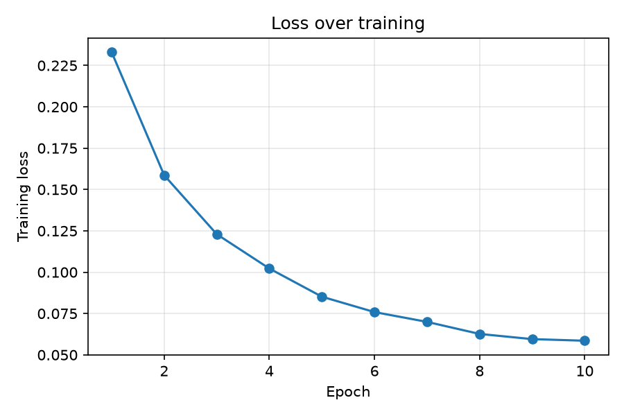
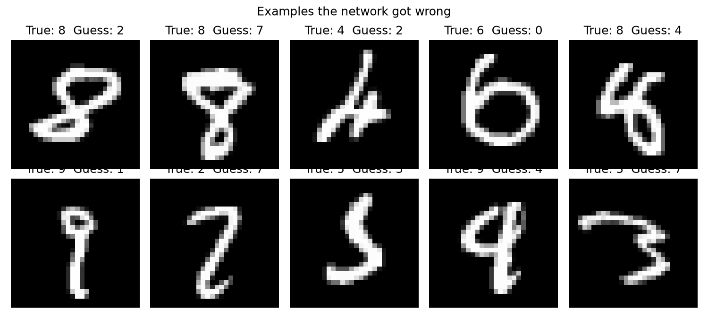

# Handwritten Digit Recognition: Neural Network from Scratch

A neural network built using only NumPy (no PyTorch or TensorFlow) that recognizes handwritten digits from the MNIST dataset with **97.24% test accuracy**.

## Why I built it

Libraries like PyTorch handle the hardest parts of training in a single line. I wanted to understand what actually happens inside: how a network makes a prediction, how it measures its mistakes, and how it learns from them. So I wrote every part by hand, including backpropagation.

## How it works

**Data**
- 60,000 training images and 10,000 test images of digits 0–9 (28 × 28 pixels, greyscale)
- Each image is flattened into 784 values and scaled from 0–255 to 0–1
- Labels are one-hot encoded (e.g. `5` → `[0,0,0,0,0,1,0,0,0,0]`)

**Network**

```
784 inputs  →  128 hidden neurons (ReLU)  →  10 outputs (softmax)
```

- **ReLU** in the hidden layer lets the network learn non-linear patterns
- **Softmax** in the output layer turns scores into probabilities for each digit
- **He initialization** for the weights, biases start at zero

**Training**
- **Loss:** cross-entropy
- **Backpropagation:** gradients derived with the chain rule and written by hand
- **Optimizer:** mini-batch gradient descent (batch size 64, learning rate 0.1, 10 epochs, data shuffled every epoch)

## Results

| Metric | Value |
|---|---|
| Test accuracy | **97.24%** |
| Wrong predictions | 276 out of 10,000 |
| Final training loss | 0.0585 |



The loss drops quickly in the first epochs and then levels off, which shows the network getting close to the best this architecture can do.

**Where it goes wrong**



Most mistakes are on digits that are unusually written or ambiguous even for a person. The most common confusions were **[e.g. 4 ↔ 9, 3 ↔ 5, 7 ↔ 2]**.

## What I learned

- **Sanity-checking the starting loss.** An untrained network guessing evenly across 10 classes should have a loss of about ln(10) ≈ 2.3. Mine started at 2.44, which confirmed the forward pass and loss were wired correctly before any training.
- **Why normalization matters.** Raw pixel values up to 255 make the weighted sums very large, which leads to unstable training and overflow in softmax. Scaling to 0–1 keeps everything in a range the network can learn from.
- **Shapes are the best debugging tool.** Every gradient must have the same shape as the weight it corrects. Working out which matrix multiplication produces that shape made backpropagation much easier to get right.
- **Softmax + cross-entropy simplify nicely.** Combined, their gradient is just *prediction − correct answer*.

## Limitations and next steps

- Flattening each image into a row of 784 values means the network loses track of which pixels are next to each other. Fully connected networks like this one usually top out around 98% on MNIST.
- **Next:** rebuild the model as a convolutional neural network (CNN) in PyTorch, which keeps the image's 2D structure and typically reaches 99%+.
- Planned experiments: hidden layer sizes (32, 64, 256), a second hidden layer, and learning rate decay.

## How to run

```bash
git clone https://github.com/majdalsuleh/mnist-numpy-neural-net.git
cd mnist-numpy-neural-net
python3 -m venv .venv
source .venv/bin/activate
pip install -r requirements.txt
```

Then open the notebook in VS Code or Jupyter and run all cells. The MNIST dataset downloads automatically on the first run.
